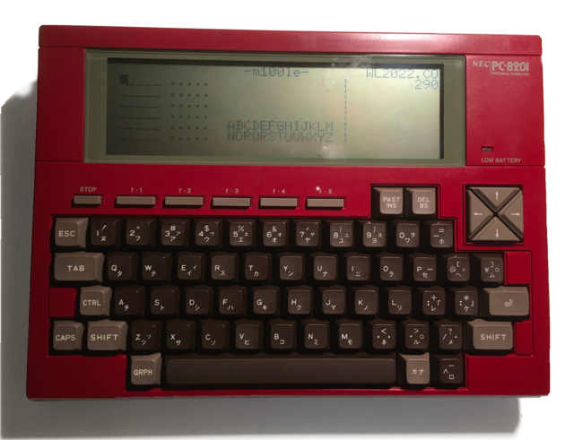

m100le - Wordle for the Tandy TRS-80 Model 100
# m100le
A version of Wordle created for a forty-year-old computer, the 
Tandy TRS-80 Model 100 (and family).


## Quickstart

If you already know how to transfer binary files to your Model 100,
you only need two files: the tokenized basic for your system (e.g.,
[M100LE.BA][4]), and the compressed wordlist for the current year
(e.g., [WL2023.CO][23]). Pick one from each of the tables below. 

<ul><details><summary>
Table of all code versions.
</summary>

| Filename                |  Size | Meaning                                                         |
|-------------------------|------:|-----------------------------------------------------------------|
| **ALL PLATFORMS**       |       |                                                                 |
| [M100LE+comments.DO][1] |  16KB | The actual source code, including all comments, in ASCII format |
| [M100LE.DO][2]          | 8.5KB | All comments removed, in ASCII format                           |
| **TANDY / TRS-80**      | <hr/> | <hr/>                                                           |
| [M100LE+comments.BA][3] |  14KB | Tokenized Tandy BASIC format, including all comments            |
| [M100LE.BA][4]          | 6.6KB | All comments removed, in tokenized Tandy BASIC format           |
| **NEC**                 | <hr/> | <hr/>                                                           |
| M100LE+comments.BA.NEC  |       | Tokenized NEC N82 BASIC format, including all comments          |
| M100LE.BA.NEC           |       | All comments removed, in tokenized NEC N82 BASIC format         |

(Note that the .BA files above are _tokenized BASIC_ and cannot be
transferred via BASIC's `LOAD` or TELCOM. See the .DO versions if you
need ASCII.)
</details></ul>

<ul><details><summary>
Table of compressed daily Word Lists.
</summary>

| Filename          | Size | Notes                                                         |
|-------------------|-----:|---------------------------------------------------------------|
| **ALL PLATFORMS** |      |                                                               |
| [WL2021.CO][21]   |   1K | Words before June 19th, 2021 are bonus words, added by M100LE |
| [WL2022.CO][22]   |   1K |                                                               |
| [WL2023.CO][23]   |   1K |                                                               |
| [WL2024.CO][24]   |   1K |                                                               |
| [WL2025.CO][25]   |   1K |                                                               |
| [WL2026.CO][26]   |   1K |                                                               |
| [WL2027.CO][27]   |   1K | Wordle's official list ends on October 14th, 2027             |

(Note that the .CO files above are _compressed binary_ and cannot be
transferred via BASIC's `LOAD` or the builtin TELCOM prgoram. See the
.DO versions if you need ASCII.)
</details></ul>

**Tip**: You can transfer all of the above files, and more, to a modern
computer by downloading the most recent .zip file from the 
[RELEASES section](https://github.com/bgri/m100LE/releases).


## Updates v0.m
### A note about this update
Though the look of the game hasn't changed much, a lot has gone on
behind the scenes, thanks to the amazing work by
[hackerb9](https://github.com/hackerb9):

<ul><details><summary>
Click to see summary of changes.
</summary>

- Hardware agnostic - runs on any of the Kyotronic sisters
  (TRS-80 Model 100, Tandy 200, Tandy 102, Kyocera Kyotronic-85,
  Olivetti M-10, NEC PC-8201, NEC PC-8201A, and NEC PC-8300).
- Speed increase - due to the following...
  - Random, instead of sequential, access to RAM file
  - Compressed binary word list files - smaller size and discourages peeking :)
  - Smarter string handling (avoid concatenations, `CLEAR` plenty of space)
- Commented and uncommented code files
- VT52 character positioning vs Tandy/NEC-specific routines
- Harmonized auto and manual date entry — play tomorrow's game today!
- Synchronized with the 'official' NYT Wordle list
- Data cleanup, code cleanup, and other optimizations

Whew, lots there -- and more detail on a few things below!

--bgrier Oct. 8, 2022
	*	*	*	*	*

### Code versions
Multiple versions of the code are now available, but you only need one
for your machine. For TRS-80 and Tandy computers, you will use
[M100LE.BA][4]. For others, or if you want the original source code,
see the [Formats](#Formats) section for more details.

### Word list files
Word list files are now compressed binary files with the extension
`.CO`, although the old `.DO` format still works. As before, you only
need to download the wordlist for the year you wish to play.

Also available are the uncompressed wordlists (.DO), which are mainly
of use if you wish to edit the words or if you are transfering the
files using the builtin TELCOM program which can only send ASCII
files. M100LE is smart enough to use the .DO files if .CO cannot be
found.
____
</details></ul>


## Documentation
**m100le** is an implementation of
[WORDLE](https://en.wikipedia.org/wiki/Wordle) for the TRS-80
Model 100 and related computers. 
<ul><details><summary>
The same code runs unmodified on all eight of the Kyotronic sisters.
</summary>



* Kyocera Kyotronic-85<sup>&dagger;</sup>,
* TRS-80 Model 100, Tandy 102, and Tandy 200,
* NEC PC-8201a, NEC PC-8201, NEC PC-8300,
* Olivetti M10<sup>&dagger;</sup>.

(<sup>&dagger;</sup> marks models not yet tested on actual hardware.)
</details></ul>
It is written in the unit's on-board BASIC, a subset of 
[Microsoft BASIC](https://en.wikipedia.org/wiki/Microsoft_BASIC)
included with the device.

WORDLE'S instructions are very simple:

* Guess the WORDLE in 6 tries.
* Every day you get a new WORDLE.
* Each guess must be a valid 5 letter word. Hit the enter button to submit.
* After each guess, the colour of the tiles will change to show how close your guess was to the word.


### Differences from Wordle

As far as possible, we have attempted to remain faithful to the
original game and gameplay. The following features were changed.

#### Valid 5 letter word
We've chosen to eliminate this constraint, given the limited onboard
memory of the Model 100.

<ul><details>

WORDLE initially checks the date and loads today's word from the
wordlist. When a guess is submitted, WORDLE checks the guess to verify
that it's a word in a [large dictionary](adjunct/allowedwords.txt)
(14,855 five-letter words). If the guess doesn't appear in the
dictionary, the guess is invalid and will not be accepted. The game
does not progress until a valid guess is made.

**m100le** initially **loads** today's word based on the system
**DATE$** value. When a guess is submitted, **m100le** compares it to
today's word, and provides the resultant clue. **m100le** does _not_
test to verify the word appears in the wordlist. A guess of 'MOIST' is
valid, as is a guess of 'DDDDD'.
</details></ul>


#### All six years of daily words
WORDLE contains a wordlist of over 2000 five-letter words, one per day
for six years. **m100le** has split the wordlist into seven files,
based on the year, so you need only download the _current_ year's
wordfile.

<ul><details>

Uncompressed, the data is over 17 KBytes; over half of the memory on a
TRS-80 Model 100. Separately, each year's data is only about 2.5 KB,
uncompressed, or 1 KB, compressed.

For example, in the year 2023, **m100le** sees the two digit year of
"23" in **DATE$** and loads the wordfile `WL2023.CO`. If you've
enabled the Manual Date Entry function (see below), then the program
will attempt to load whatever wordlist file that corresponds to the
year entered. 
</details></ul>

#### Coloured tiles
As the Model 100 uses a monochrome LCD display, we don't have the
ability to use colours to provide the clues. Instead, **m100le** shows
symbols.

For each guess, a line in the **Clue Panel** will be filled in with
the clue for that guess, and the cumulative **Alphabet Panel** will be
updated.

| Clue                        | Name               | Meaning                                                 |
|:---------------------------:|--------------------|:--------------------------------------------------------|
| <kbd>.</kbd>                | Period             | Wrong letter                                            |
| <kbd>?</kbd>                | Question mark      | Letter is in word, wrong location                       |
| <kbd>_X_</kbd>/<kbd>*</kbd> | Letter or asterisk | _X_ = Any letter in proper location<sup>&ddagger;</sup> |

##### <sup>&ddagger;</sup> an asterisk will appear in the **Alphabet Panel**, and the actual correct letter will appear in the **Clue Panel**


## Gameplay

Daily, a five-letter word is selected and players have six tries to
guess it. Each guess is rewarded with clues. After every guess, each
letter is evaluated and marked in the **Clue Panel** as either
<kbd>X</kbd>/<kbd>\*</kbd>, <kbd>?</kbd>, or <kbd>.</kbd> (CORRECT
LETTER, QUESTION MARK, or PERIOD). 

_<kbd>X</kbd>_/<kbd>\*</kbd> CORRECT LETTER, a letter from A to Z in
**Clue Panel** and an asterisk in **Alphabet Panel**, indicates that the
letter is correct and in the correct position.

<kbd>?</kbd> QUESTION MARK indicates that the letter is in the answer
but not in the proper position.

<kbd>.</kbd> PERIOD means that the letter is not in the answer at all. 

Note that to play the same as the official Wordle, M100LE now marks
multiple instances of the same letter in a guess, such as the "P"s in
"POPPY", with a QUESTION MARK even if the letter only appears once in
the answer. (In previous version of m100le, excess repeating letters
were shown as a PERIOD.)

### End of game
When either the word is guessed correctly, or no correct word is
guessed after six attempts, the game ends and you have a few options:

- [A]GAIN? - Prompt for a new date to play
- [R]ANDOM? - Starts a new game with the word chosen randomly from
  this year's wordlist
- [S]OCIAL? - Display your game's progress in a way suitable for
  sharing on social networks (Take a photo of the display & impress
  your friends :)
- [Q]UIT? - End the program execution and return to the main system menu.


## Today's game requires today's date

Many Model 100 computers no longer have working internal battery
backups for the clock and will have the wrong date set. You can fix
this by setting DATE$ or by altering the program.

<ul><details><summary>Setting the DATE$ in BASIC</summary>

To set the date once, go to BASIC and type the following:

``` BASIC
DATE$="12/31/23"     :REM MM/DD/YY format, usually
DATE$="23/12/31"     :REM YY/MM/DD for NEC portables
```

Note that this is only a temporary fix if your internal battery is
shot. Tip: It's a good idea to replace it before it starts leaking and
damages your unit. 
</details></ul>

<ul><details><summary>Enabling Manual Date Entry</summary>

If your `DATE$` is never set correctly or you'd like to replay a
specific game, you can change M100LE to always prompt for Manual Date
Entry at startup by changing line 16 to set `MD` to 1:

```BASIC
16 MD=1
```

This will prevent the game loading today's game from DATE$ on startup
and lets you play a game from any date, presuming you have the word
file for that year loaded into your unit's memory.
</details></ul>

<ul><details><summary>Date entry format</summary>

If you have enabled Manual Date Entry or if you restart the game with
the <kbd>A</kbd> (AGAIN) key, you will be prompted for the date you
wish to play.

## TODO XXX date entry screenshot here XXX

The system will prompt you for the date in **`MM/DD/YY`** format. (NEC
portables use `YY/MM/DD`). Two digits _must_ be used for month, day,
and year, so add a leading `0`, as needed.

If you hit <kbd>Enter</kbd> without typing anything, it will use the
default date which is either the previously played date (when the
AGAIN option is used) or the system DATE$ (when first run).

Alternately, you may enter the ordinal 'Day-of-Year' ex. `200` for the
200th day of the loaded year. Optionally, you may specify a year
_before_ the ordinal day. For example, `21/170` would give you the
170th day of the year 2021, which happens to be the first Wordle game
in the official Wordle wordlist. The ordinal day is shown on the right
side of the screen while playing. Subtract one to play the previous
day's word.

### Y2K Compliance

M100LE works fine whether or not your m100 has a [Y2K patched
ROM](http://bitchin100.com/wiki/index.php?title=REXsharp). The century
is just cosmetic as the m100 only keeps track of the last two digits
and the game presumes you are in the 21<sup>st</sup> century. For
example, if you set `DATE$="06/20/26"`, you'll get the same game no
matter whether the main MENU shows 1926 or 2026.

</details></ul>


## Installation

If you know how to transfer binary files to your Model 100, just grab
the two files mentioned above in the [Quickstart section](#Quickstart). 
If you do not know how (or lack the tools), read on.


### ASCII install 

You will need to transfer both the M100LE program and at least one
wordlist file in ASCII and convert them to binary. Because the ASCII
versions are significantly larger, these instructions include some
tricks to save memory.


<ul><details><summary>Click to see the steps for an ASCII install</summary>

#### Step 1: Connect Model 100 to a modern computer

You will need a NULL modem cable. Since current computers do not come
with serial ports, you will likely also need a USB to Serial adapter.

> Warning: if you get certain serial adapters, your transfers will be
> garbled. Technically, you'll need a device that has hardware-level
> XON/XOFF flow-control, but that's rarely listed on the box. Some
> keywords to look for that you _might_ see in advertising: "on-chip
> flow control", "16950 UART", "MU860", or "FTDI". Additionally,
> _most_ adapters labelled "PL2303" will work, but not all of them.

#### Step 2: Load CMPRSS on your Model 100

On your Model T, type this to load the program from the serial port:

```BASIC
LOAD "COM:98N1ENN"	 :REM FOR NEC, USE COM:9N81XN
```

Then, use your connected personal computer's "send file" ability to
send the [CMPRSS.DO](CMPRSS.DO) ASCII file over the serial port at
19.2 Kbps. If you do not know how to send a file, please see
[sendfile.md](sendfile.md).


<ul><details><summary>Click to learn more about CMPRSS.</summary>

CMPRSS is a basic program that runs on your Model T to create the
binary file, `WL20_xx_.CO` from the ASCII file `WL20_xx_.DO`, both of
which contain the daily words M100LE uses for a particular year,
20_xx_. There are three ways of using CMPRSS:

1. Serial port. CMPRSS can read the ASCII list of words over the
   RS232C serial port from a modern computer. This is the recommended
   method and what will be detailed below. It uses the least RAM. Its
   primary downside is that it requires learning how to send ASCII
   files from a personal computer.

1. RAM storage. CMPRSS can also read from the Model 100's file system.
   If you know how to transfer ASCII files using TELCOM, this may be a
   useful alternative. (Note, if you know how to transfer files in a
   different way, then you are in the wrong instructions. You can just
   use the [precompressed wordlists](#Quickstart)). 

1. Not at all. CMPRSS is optional. The M100LE program actually works
   fine with uncompressed ASCII word lists. It just takes up
   unnecessary space on the Model 100's limited RAM filesystem. (2.5
   KB per year instead of 1 KB).

Because it takes extra RAM that might not be available once the M100LE
program is loaded, it is best to load and run [CMPRSS](CMPRSS.DO)
firstd. CMPRSS is a BASIC program that runs on the Model 100. It reads
words from the serial port from a personal computer that is sending the
wordlist in ASCII. CMPRSS writes them out to a binary file in the RAM
storage, usually named WL20_xx_.CO. (Where 20xx is a year.)
____
</details></ul>

#### Step 3: Pick an uncompressed, ASCII wordlist
Download one of the following files to your personal computer:

<ul><details><summary>
Table of uncompressed Word Lists.
</summary>

| Filename          | Size | Notes                                                         |
|-------------------|-----:|---------------------------------------------------------------|
| **ALL PLATFORMS** |      |                                                               |
| [WL2021.DO][31]   | 2.5K | Words before June 19th, 2021 are bonus words, added by M100LE |
| [WL2022.DO][32]   | 2.5K |                                                               |
| [WL2023.DO][33]   | 2.5K |                                                               |
| [WL2024.DO][34]   | 2.6K |                                                               |
| [WL2025.DO][35]   | 2.5K |                                                               |
| [WL2026.DO][36]   | 2.5K |                                                               |
| [WL2027.DO][37]   | 2.0K | Wordle's official list ends on October 14th, 2027             |

____
</details></ul>

#### Step 4: Run CMPRSS

Run CMPRSS to load words from the serial port and use the connected
computer to send the WL20_xx_.DO file. 

<ul><details><summary>Explanation of running CMPRSS</summary>

When run, CMPRSS will ask you for where to load the words from and
where to save them. CMPRSS can load data over the serial port or a .DO
file. 

If you are using the serial port, the default (`COM:...`)should be
correct and you can just hit <kbd>ENTER</kbd>.

Once CMPRSS says, "Waiting for COM:", use the 
"[send file](sendfile.md)" mechanism on your personal computer to send
the WL20_xx_.DO ASCII word list over the serial port.

After you are finished compressing all the wordlists you intend to use,
you may delete CMPRSS.BA, or, if you have enough RAM, you may save it.

```BASIC
NEW
KILL "CMPRSS.BA"
```
or
```BASIC
SAVE "CMPRSS.BA"
```
____
</details></ul>


#### Step 5

Now that the wordlist is transferred, all that is needed is the actual
M100LE program. This is sent exactly the same as CMPRSS was in step 1. 

```BASIC
LOAD "COM:98N1ENN"				:REM FOR NEC, USE COM:9N81XN
```

Then, use your connected personal computer's "[send file](sendfile.md)" 
ability to send the [M100LE.DO](M100LE.DO) ASCII file over the serial
port at 19.2 Kbps. 

**Important**: don't forget to `SAVE "M100LE"` after transferring the
program over the serial port.

You now have M100LE.BA on your machine and can play today's Wordle!
Try `RUN`.

### Formats

As mentioned above, there are multiple versions of the program
available. Only one file, ([M100LE+comments.DO](M100LE+comments.DO)),
is the true source code. All others are derived automatically, mostly
for smaller file size and to ease installation.

There are two variables that cause the proliferation of files:

1. **Comments** By default files have comments stripped to keep the size down.
   Versions which contain "+comments" in the filename include notes
   for developers who wish to edit or improving M100LE.

2. **Tokenization** Files can be in ASCII or one of four binary formats.
   * ASCII BASIC source code has two main benefits: it will run on any
     of the platforms and it can be downloaded by the builtin TELCOM
     program. ASCII format can be read on any machine and will run on
     any of the platforms. However, downloading requires an extra
     tokenization step which may require more memory than your
     computer has. (But, see [installation](#Installation) for a
     workaround.)
     * **.DO** Runs on any of the Kyotronic Sisters
   * Tokenized BASIC format which saves memory during transfer, but
     requires using a program such as TEENY which can download binary
     files. Tokenization is specific to each family of machines.
	 * **.BA** Runs only on Model 100, Tandy 102 (US and UK), and Tandy 200.
	 * **.BA.NEC** Runs only on NEC PC-8201, PC-8201A, and PC-8300.
	 * **.BA.K85** Runs only on Kyocera Kyotronic-85
	 * **.BA.M10** Runs only on Olivetti M10


## Roadmap

- Add the ability to save and display statistics
- Improve clues, guess feedback and messages
- Do the impossible: Cram Wordle's 72 KB spelling dictionary into 10 KB (or less).

## FAQ
### About the word files and today's word
The current version of **m100le** (greater than v0.l) uses the New
York Times Wordle word lists. Prevously, the wordfiles used were based
on the the **original** javascript WORDLE, which contained the entire
set of daily words (the wordfile) within the program code. Over six
years worth of words.

While the order changed, there are
[very few differences](https://github.com/jackgreenburg/wordle-wordlists)
between the original and the current word lists.

### How wordfiles work
Big wordfiles wouldn't work for our little units, so we broke each
wordfile into manageable chunks of one year each. The .CO files are
also compressed so each five-letter word takes only three bytes. If
you have enough memory and you'd like to see and change the words, you
may want to download the plain text WL20xx.DO files instead. M100LE
will automatically use a .DO file if the .CO file is not found.

The wordfiles are all named for the year they correspond to. On
program load, **m100le** checks the system **DATE$** for the current
date OR the manually entered date (if enabled) and scans the
appropriate wordfiles for the matching daily word.

### Will my m100le word be the same as today's NYT Wordle word?
Maybe. Mostly. It ought to, anyhbow. The NYT may change their word
list at any time. If that happens, and we don't catch it, let us know
and we'll update ours.

## Feedback

If you have any feedback, please reach out to us:
- in the [discussions area](https://github.com/bgri/m100LE/discussions) for general conversation about m100LE
- in the [issues area](https://github.com/bgri/m100LE/issues) for bugs and feature requests


## Acknowledgements

 - [Josh Wardle - Wordle's creator](https://en.wikipedia.org/wiki/Josh_Wardle)
 - [hackerb9](https://github.com/hackerb9) - significant optimization and improvements. This thing rocks!!
 - [TRS-80 Model 100 BASIC - based on Microsoft BASIC, with special support for the RAM file store, LCD display, and other built-in hardware of the TRS-80 Model 100 and Tandy 102 portable computers](https://archive.org/details/MasteringBasicOnTheTrs80Model100/page/n5/mode/2up)


## Authors

- [@bgrier](http://blog.bradgrier.com)
- [hackerb9](https://github.com/hackerb9)

	[1]: https://raw.githubusercontent.com/bgri/m100LE/main/M100LE%2Bcomments.DO
	[2]: https://raw.githubusercontent.com/bgri/m100LE/main/M100LE.DO
	[3]: https://raw.githubusercontent.com/bgri/m100LE/main/M100LE%2Bcomments.BA
	[4]: https://raw.githubusercontent.com/bgri/m100LE/main/M100LE.BA
	[21]: https://raw.githubusercontent.com/bgri/m100LE/main/WL2021.CO
	[22]: https://raw.githubusercontent.com/bgri/m100LE/main/WL2022.CO
	[23]: https://raw.githubusercontent.com/bgri/m100LE/main/WL2023.CO
	[24]: https://raw.githubusercontent.com/bgri/m100LE/main/WL2024.CO
	[25]: https://raw.githubusercontent.com/bgri/m100LE/main/WL2025.CO
	[26]: https://raw.githubusercontent.com/bgri/m100LE/main/WL2026.CO
 	[27]: https://raw.githubusercontent.com/bgri/m100LE/main/WL2027.CO
  	[31]: https://raw.githubusercontent.com/bgri/m100LE/main/WL2021.DO
	[32]: https://raw.githubusercontent.com/bgri/m100LE/main/WL2022.DO
	[33]: https://raw.githubusercontent.com/bgri/m100LE/main/WL2023.DO
	[34]: https://raw.githubusercontent.com/bgri/m100LE/main/WL2024.DO
	[35]: https://raw.githubusercontent.com/bgri/m100LE/main/WL2025.DO
	[36]: https://raw.githubusercontent.com/bgri/m100LE/main/WL2026.DO
	[37]: https://raw.githubusercontent.com/bgri/m100LE/main/WL2027.DO
